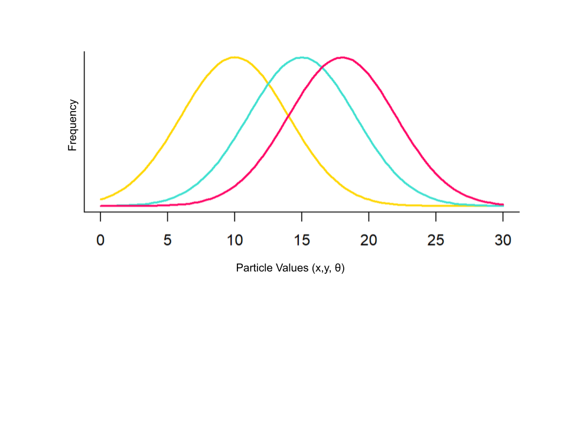
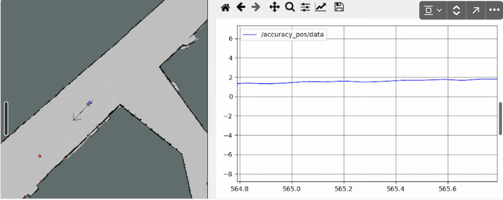
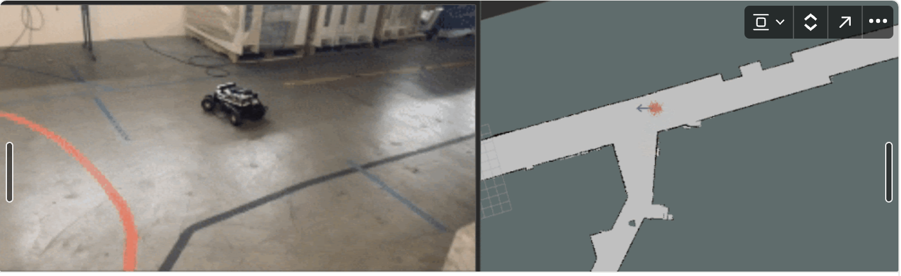
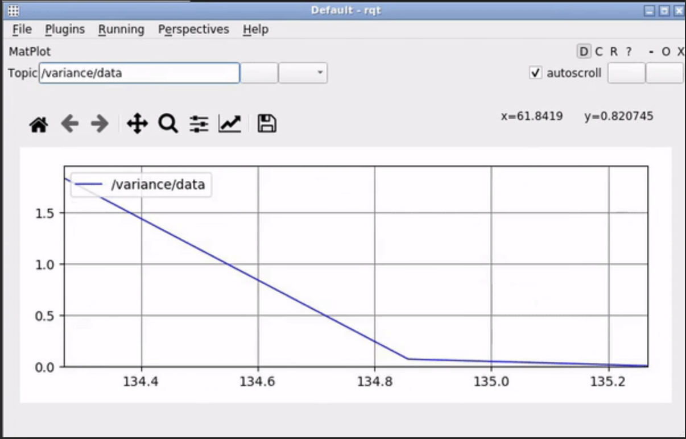

# LAB 5 REPORT: Monte Carlo Localization (MCL)

## I. Introduction

_Author: Rulan Gu_

In autonomous vehicles, location estimation is a very useful feature when attempting to navigate through a mapped environment. Autonomous cars, for example, use a GPS system to know where they are in the real world, which enables them to plan routes to a location and anticipate upcoming obstacles and turns that cameras or sensors wouldn’t be able to detect. Thus, implementing a location estimation feature would greatly contribute to our overall goal of designing an autonomous car.

So far, we have implemented some autonomous routines for our robot: it can park at a cone and follow walls and orange lines. However, it still can’t navigate through a known area (such as the State basement). In Lab 5, our goal was to implement an algorithm to estimate the robot’s current position on the map (in our case, a map of the State basement) in order to enable future features such as path planning.

To accomplish our goal, we designed a Monte Carlo Localization (MCL) algorithm, which averages a probability distribution of particles that represent possible locations of the robot to find the estimated location. This algorithm is composed of three main parts:

- Motion model: Calculates the next set of particles (where the robot might be next) based on the robot’s odometry and previous set of particles.
- Sensor model: Uses laser scan data to calculate the probability of the robot being at each particle.
- Particle filter:
  - Updates particles when motion model is updated
  - Resamples particles based on the probabilities calculated in sensor model
  - Each time particles is updated by either model, publishes the new estimated robot pose, which is the average of all the particles.

In our implementation, we first initialize a particle cloud based around the robot’s initial position. Then, the particle filter runs repeatedly, starting with the initial particle cloud and updating estimated pose each time the motion or sensor models update.

## II. Technical Approach

_Author: Aimee Liu_

This section details the methods used to develop a working Monte Carlo Localization, or particle filter, using a motion model and sensor model to update the particle positions and determine the probability of each position. This particle filter is then implemented into our physical robot car in order to capture a real-time representation of the robot’s location on a map as it drives around the basement of the MIT Stata Center.

Errors compound quickly when the robot loses track of its location — therefore, to maintain the robustness of the robot’s representation on the map, each component of the designed model must be optimized for accuracy and speed.

### A. Motion Model

_Author: Aimee Liu_

As the robot drives about in its environment, its detected location must change along with its movement. This process can be implemented with a motion model, which uses the sensed change in position, or odometry, of the robot to update its position on the map. In Monte Carlo Localization, the robot is represented as an array of particles representing potential positions, so the motion model must update the position of each particle with some defined noise to capture the true pose.

**Updating Position with Transformation Matrices**

One of the simplest ways to update the position of an object with its odometry is by using transformation matrices, which can be derived from the object’s pose vector, x, as represented by (1).

$$
x = [x,y,\theta]^T \tag{1}
$$

Here, $x$ and $y$ represent the object’s 2D coordinates and $\theta$ represents its orientation. This pose vector can be used to create a transformation matrix $T$, through formula, (2).

$$
T = \begin{bmatrix}
R & p \\
0 & 1
\end{bmatrix} = \begin{bmatrix}
\cos(\theta) & -\sin(\theta) & x \\
\sin(\theta) & \cos(\theta) & y \\
0 & 0 & 1
\end{bmatrix} \tag{2}
$$

We can use this method to construct the transformation matrix of the object at timestep $k-1$, $T_{x_{k-1}}$, and the odometry, $T_{\Delta x}$, in order to find the updated location of the object at timestep $k$, $T_{x_{k}}$, using formula (3).

$$
T_{x_k} = T_{x_{k-1}}T_{\Delta x} \tag{3}
$$

From, $T_{x_{k}}$, we can extract entries $(1,3), (2, 3), (2, 1)$, and $(1, 1)$, to get $x$, $y$, $sin(\theta)$, and $cos(\theta)$, from which we can also get and $\theta = atan(\frac{sin(\theta)}{cos(\theta})$ for the next pose.

**Adding Noise to the Odometry**

Due to various inaccuracies from sensors and the environment, our robot may never be able to identify its exact position and orientation on a map. Thus, it is instead represented by an array of particles which show its possible locations on the map. These particles are updated to move with odometry input, but the estimated odometry received by the robot’s sensors is not often precise. Therefore, noise drawn from a normal distribution centered around this received estimate must be added to spread the particles enough to capture the true odometry.

This noise must be carefully tuned so that the particles are capable of converging to the true odometry while retaining as much information from the estimate as possible. As demonstrated by _Fig. 1_, a low spread would be too densely packed in one location to capture the true odometry if the sensor odometry is not accurate enough and a high spread would be too far apart to consistently find or get close to the true odometry. A good spread well encompasses the true odometry, with multiple particles within the vicinity that can get as close to the true odometry as possible.

![***Fig. 1.*** **The optimal spread is between the low and high spread, where the particles are able to consistently encompass and get close to the true odometry with its variance.** The robot is represented by the black box, the particles are represented by the red dots, and the true odometry is represented by the blue dot. In the depiction of a Low Spread, the particles are too densely packed in one location, and therefore too far from the true odometry to converge. In the depiction of a High Spread, the particles are too far apart to accurately find the true odometry and converge. The optimal spread would best be used to converge to the true odometry.](imgs/Lab%205%20Report%20bf4998b43c0c4d6fa686559fbbb64070/fd385321-bcf3-451e-85cb-99c135a5a615.png)

**_Fig. 1._** **The optimal spread is between the low and high spread, where the particles are able to consistently encompass and get close to the true odometry with its variance.** The robot is represented by the black box, the particles are represented by the red dots, and the true odometry is represented by the blue dot. In the depiction of a Low Spread, the particles are too densely packed in one location, and therefore too far from the true odometry to converge. In the depiction of a High Spread, the particles are too far apart to accurately find the true odometry and converge. The optimal spread would best be used to converge to the true odometry.

The optimal spread we chose which met the criteria was $\epsilon_x = 0.3$, $\epsilon_y = 0.3$, and $\epsilon_\theta = 0.005$.

**Synthesis: Updating Each Particle with Noisy Odometry**

For every timestep, each of the $N$ particles representing the robot’s position is updated to its next pose using an odometry with added noise using the transformation matrix method described earlier in this section. However, this may become computationally inefficient. To improve the speed of our model, all N noisy odometry vectors are created at once as a 3xN matrix and each computation is performed only once as an N-sized array of all the particles. This ensures that instead of each particle being updated one-by-one in series, the particles are all updated simultaneously in parallel, greatly reduceing the computation time of the model.

This motion model constructs a spread of particle that consistently encompasses the true odometry to accurately predict the next position of the robot on the map, and is optimized to be quick and computationally efficient to keep up with the car.

### B. Sensor Model

_Author: Sruthi Parthasarathi_

The motion model therefore gives us a space of possible locations for the car, but what we actually require is something more — while all of these locations are possible, they are not equally likely. Therefore, what we truly desire is a probability distribution across that space.

---

**Particle Likelihoods**

In order to do this, we start by asking ourselves the following: given a scan received in live time from the robot, how likely is the robot to have the pose of a given particle? Answering this allows us to determine an updated probability distribution for the true location of the robot from the current probability distribution, which is represented by the samples in the particle cloud.

This probability is proportional to the conditional probability of observing the scan given the pose of the particle— since the particle probabilities are normalized in later steps, we compute this quantity instead for each of the particles in the cloud and absorb the constant of proportionality into the normalization constant, shown in (4).

$$
P(p_k|z_{1,...,n}) \propto P(z_{1,...,n}|p_k) = \prod_{i=1}^n P(z_i|p_k) \tag{4}
$$

Each individual scan data’s probability is given by the following formula, (5), with $\alpha$’s chosen to add to 1, and probability values as defined in (6), (7), (8), and (9).

$$
P(z_i|p_k) = \alpha_{hit}p_{hit} + \alpha_{short}p_{short} + \alpha_{max}p_{max} + \alpha_{rand}p_{rand} \tag{5}
$$

$$
p_{hit}(z_i|x_k, m) = \begin{cases}  \eta\frac{1}{\sqrt{2\pi\sigma^2}}\exp(-\frac{(z_i - d)^2}{2\sigma^2}) & \text{if $0 \leq z_i \leq z_{max}$} \\   0 & \text{otherwise}\end{cases} \tag{6}
$$

$$
p_{short}(z_i|x_k, m) = \frac{2}{d}\begin{cases}  1 - \frac{z_i}{d} & \text{if $0 \leq z_i \leq d$ and $d \neq 0$} \\   0 & \text{otherwise}\end{cases} \tag{7}
$$

$$
p_{max}(z_i|x_k, m) = \begin{cases}  \frac{1}{\epsilon} & \text{if $z_{max} - \epsilon \leq z_i \leq z_{max}$} \\   0 & \text{otherwise}\end{cases} \tag{8}
$$

$$
p_{rand}(z_i|x_k, m) = \frac{2}{d}\begin{cases}  1 - \frac{z_i}{d} & \text{if $0 \leq z_i \leq d$ and $d \neq 0$} \\   0 & \text{otherwise}\end{cases} \tag{9}
$$

For a particle $p_k$ and scan range $z_i$, $x_i$ is the particle’s position, $m$ is the map, and $d$ is the true distance for that scan data point.

**Eliminating Repetitive Computations**

Once we choose appropriate values for the alpha parameters, we can directly compute $P(z_{1,...,k}|p)$ for each particle. However, this process becomes computationally expensive very quickly when processing scans from the car in real time.

**_Fig. 2._ The precomputed sensor model for pre-chosen alpha values.** Rather than compute probabilities for each particle in real-time as the sensor sends data, it is more computationally efficient to discretize and precompute the values beforehand and pull these values when needed.

To combat this, we trade some accuracy for speed by storing a table of precomputed probabilities. Note that each probability only requires knowing the corresponding measured distance $z$ and the ground truth $d$, and is unaffected by choice of units (changes in the distribution due to scaling are accounted for by the standard deviation). Therefore, our table stores probabilities for all pairs $(z, d)$ where the two parameters are integers and range from $0$ pixels to $200$ pixels. As the scale from the real world to the pixels is fixed, the robot can simply use the scaling factor to convert its measurements to pixels, round to the nearest integer, and index into the table accordingly rather than repeatedly evaluating the functions above.

And this is precisely what the robot does. By downsampling the laser scans to additionally reduce computational overhead, the sensor model calculates the likelihood values for each particle in the cloud, which the particle filter can then normalize to transform the space of possible positions into an actual probability distribution for the ground truth pose.

_Edited by Aimee Liu_

### C. Particles Filter

_Author: Tyrin Todd_

The particles filter integrates the sensor model and the motion model to get a predicted pose. On a high level, it follows a 4 step process to achieve this.

1. Get an initial distribution of particles based on ground ground truth data.
2. Use laser scan and sensor model to update particle distribution
3. Calculate new particles using motion model and predicted odometry
4. Each time particles is updated, publish an average pose

**Step 1: Initialize particles**

Initializing the particles is fairly straightforward. The robot always has access to some ground truth pose, therefore we can use a normal distribution centered at the ground truth pose with a variance, $\sigma$, for the initial particle values, as demonstrated by _Fig. 2_. We decided to use a variance of 0.1 because it generated a satisfactory and wide spread of particles around the robot.

**_Fig. 3._** **Gaussian Distribution** shows how different particle values (x,y,theta) are normally distributed by frequency.

**Step 2: Update particle distribution based on laser scan**

The next step involves adjusting the particle distribution based on incoming LiDAR data. Both the particles and the laser scan are processed through the sensor model, as described in _Section 2.B._, which generates a list of probabilities for each particle's accuracy. These probabilities are then used to resample particles, ensuring that particles with higher probabilities are represented more frequently than those with lower probabilities.

**Step 3: Update particle distribution based on odometry**

In step 3, the current odometry data is calculated. Then, the motion model, described in _Section 2.A._, is applied to the current particle distribution and odometry, yielding a new particle distribution for the next timestep. The odometry calculation involves converting continuous-time velocity, $v$, measurements into their displacement counterparts by multiplying them by $dt$, the change in time to find the change in the $x$, $y$, and $\theta$ positions; $dx$, $dy$, and $d\theta$ respectively; as shown in (10).

$$
dx = v_x*dt \tag{10}
dy = v_y*dt
d\theta = v_{\theta}*dt
$$

There were multiple options to get velocity in this equation, such as using the current velocity or the previous. To take both velocities into account, we decided to use the average of the two velocity to calculate odometry for an updated formula, (11).

$$
dx = (v_x-v_{x0})/2*dt
dy = (v_y-v_{y0})/2*dt
d\theta = (v_{\theta}-v_{\theta0})/2*dt \tag{11}
$$

**Step 4: Update pose**

Every time the particles are updated an average must be calculated. Unfortunately, this is not trivial as it seems. As described in the lab write up, “an average could pick a very unlikely pose between two modes” [1]. For example if the data were to look like _Fig. 4_, the algorithm inaccurately predicts our pose at the red triangle which has a low probability distribution and is therefore likely inaccurate. Our model is almost certain the robot is not there.

**_Fig. 4._ Improved predicted position using mode clustering.** The dots are now grouped into different colored clusters. The algorithm chooses the cluster with the most particles, in green, and uses the mean of cluster, resulting in an improved prediction of where the robot may be, as there is a high probability distribution at its location.

Instead a better approach would be to split the data set into “clusters”. The biggest cluster will correspond to an area that our model is the most confident the robot is currently located in. Then we can take the average of this cluster to calculate the pose. As you can see in _Fig.5_, the predicted position is located in an area where the model has high confidence (The cluster with the most particles).

**_Fig. 5._ Improved predicted position using mode clustering.** The dots are now grouped into different colored clusters. The algorithm chooses the cluster with the most particles, in green, and uses the mean of cluster, resulting in an improved prediction of where the robot may be, as there is a high probability distribution at its location.

This procedure creates a robust particle filter that can accurately estimate the location of the robot on a map, being less susceptible to outliers and errors in the sensor data, and quickly update due to the reduced computation time of the motion and sensor models. The success of the particle filter in simulation is evaluated in _Section 3.A_.

_Edited by Aimee Liu_

### D. Robot Implementation

_Author: Aimee Liu_

In order to implement the particle filter in the physical robot, we must change the parameter values used for the robot to instead use the physical robot parameters. The topics the robot reads for the particle filter is changed to read from the real robot’s LiDAR scan and odometry. In addition, we must also reverse the directions of the $x$, $y$, and $\theta$ axes since the robot views these values in the opposite direction. Performing these two changes prepares the particle filter to be used in the real world.

However, before the translation from simulation to the real world may not always be very exact, as there is more noise and sensor errors that may arise on the physical robot that we typically don’t need to be concerned with on the simulation. Therefore, more fine tuning is necessary for the variances in the motion model or clustering in the particle filter. Despite this, our original values tuned to the simulation data still worked well on the physical robot and did not need as much adjustment, so our values remained relatively the same. The success of the particle filter in the robot is evaluated in _Section 3.B_.

## III. Experimental Evaluation

_Author: Aimee Liu_

This section evaluates the robustness of our model in both simulation and reality. With the particle filter completed and implemented in the robot, it is important to verify the accuracy of our algorithm in tracking the robot’s position on a map. To do this, we tested the particle filter on both the simulation and physical car using a predetermined map of the MIT Stata basement. From this we can use different methods to evaluate the effectiveness of our algorithm both qualitatively and quantitatively.

### A. Performance in Simulation

_Author: Bradyn, Ty_

An advantage of operating in simulation is that the ground truth for the position of the robot is known. This allows for testing the accuracy of the localization algorithm. The distance from the localization algorithm’s expected position is compared to the true position of the robot to represent the error and plotted over time. We can see that the error is higher during times with higher velocity. Though the error went up during the middle of the movement, it is promising that the error goes back down to near zero once the robot comes to a stop, showing that the algorithm can converge back onto the correct solution, which is demonstrated in _Fig. 6_.

[https://drive.google.com/file/d/1qxt23u8WpZIM8nb53QbIi9XYlA9mo_cr/view?usp=drive_link](https://drive.google.com/file/d/1qxt23u8WpZIM8nb53QbIi9XYlA9mo_cr/view?usp=drive_link)

**_Fig. 6._ Error between localization position estimate and ground truth.** The x axis represents time with the y axis being the L2 norm of the (x, y) values for each.

For our model to be robust the particles must remain well dispersed. Convergence of the particles leaves the model unable to cover enough area to be flexible to error. Similarly, divergence leaves the model too general and unable to focus on poses that matter. To track the how dispersed the particles were and how fast the model is converging we used the variance as shown in _Fig. 7_.

**_Fig. 7._ Variance over time in simulation.** On the left you see a big spike in the variance and then it gradually converges to a stable value ~0.1 on the right. The x axis represents time and the y axis represents variance.

### B. Performance in the Real World

_Author: Bradyn, Ty_

In order to get our localization algorithm working on the robot, we had to make a few changes to the params.yaml file in order to make everything publish to the correct topics. After debugging issues with axes, the localization algorithm was working. An initial guess was given for the position of the robot in RVIZ. Immediately, we saw the pose of the best guess change slightly. After testing with poor initial estimates, we saw that the algorithm would move the best guess to a more reasonable location. This demonstrates an insensitivity to small errors in initial guesses for the pose, as shown in _Fig. 8_.

[https://drive.google.com/file/d/1ioPuT2ldmXYHNusVVRQOF-l_ed7SAjBA/view?usp=drive_link](https://drive.google.com/file/d/1ioPuT2ldmXYHNusVVRQOF-l_ed7SAjBA/view?usp=drive_link)

**_Fig. 8._ Side by side of video of robot driving in Stata basement and localization running in RVIZ.** Note how well the two correlate with each other besides the small time lag.

Once the initial position stabilized, we began using teleop to control the robot. Despite the lag in the localization algorithm's output, it maintained a stable and reasonable pose most of the time. Issues did arise in scenarios like navigating through the narrow space near the lab entrance and in cluttered areas. Nevertheless, it was encouraging to observe that the estimated pose did not worsen over time during regular driving.

Using teleop mode we were also able to test the variance, the results of which are shown in _Fig. 9_. Similar to the variance in _Section 3.A_, it starts out very high when the particles are initially dispersed then it quickly collapses to a stable value. The stable variance in the real world and in simulation are almost the same which tells us that our particles are converging properly on hardware.

[https://drive.google.com/file/d/1h4kKK38vpNltE-2wNhMxgGtICfhzLlww/view?usp=drive_link](https://drive.google.com/file/d/1h4kKK38vpNltE-2wNhMxgGtICfhzLlww/view?usp=drive_link)

**_Fig. 9._ Variance over time in physical robot.** The following graph shows variance over time as the physical robot drives in the MIT Stata basement. It starts with a huge spike in variance during initialization then quickly converges to ~0.1 and remains there throughout the run. The x axis represents time and the y axis represents variance.

## IV. Conclusion

_Author: Rulan Gu_

This paper presents our implementation for location estimation of our autonomous robot. Our robot is now capable of estimating where it is on a map of the Stata basement. To do this, we averaged a cloud of particles representing possible robot locations to get its estimated location. We updated our particle cloud by using odometry to calculate the next position of the particles and by using laser scan data to calculate the probability of the robot being at each particle. In simulation, the particle cloud was accurate to the robot’s true location while also maintaining a reasonable variance. In the real world, we were able to qualitatively observe that the robot’s location estimation was accurate based on the estimated pose on the Stata basement map.

Further work can still be done on evaluating the accuracy of the robot’s real world performance quantitatively. One way to do this would be to run the wall-following algorithm, which was designed previously, and the MCL algorithm at the same time and see if the MCL algorithm accurately estimates the distance from the wall. Additionally, we noticed that the particle cloud seems to lag at high speeds, which could be due to the models not updating frequently enough to keep up or excessive computations being done. On longer stretches with similar walls (such as long straight hallways), the more uniform nature of the laser scan data also seemed to cause the particle resampling to be ineffective.

Overall, our location estimation algorithm has been implemented successfully. This useful feature will enable us to implement features such as path planning in the future since we can now find our robot’s location on the map.

### Lessons Learned

Each member of the team contributed heavily to the success of the project. As a result, we each learned various lessons in both the technical and communicative aspects of the lab.

_Author: Rulan Gu_

This lab taught me how to use probability to figure out the location of a robot on the map. I was able to learn about a very interesting localization algorithm. The lab was very challenging and I honestly wish we were given a bit more time to do it, but it also taught me how much we can get done as a team in just a week.

_Author: Bradyn Lenning_

This lab taught me a lot about how effective a team can be when work is distributed well. We all got our parts working well, but unsurprisingly integration was challenging. Eventually we got everything working together though! It was also interesting learning about how much precomputing can speed up a program.

_Author: Aimee Liu_

This lab taught me much about probability and how to use it to predict motion. I was able to practice my skills in transformations and mathematically solving for next states with matrices.

I also learned to take initiative, make plans, and delegate tasks to meet deadlines. Organization, consistency, and frequent communication greatly improves the workflow of the team.

_Author: Sruthi Parthasarathi_

I particularly enjoyed this lab because a large part of designing our systems in simulation required us to be thoughtful about increasing robustness to errors in the real world, rather than accounting for them after integration with the robot.

I also gained more experience debugging with the hardware, and we collectively learned to delegate tasks in a way that aligned with the interests and strengths of the team members.

_Author: Tyrin Todd_

During this lab I enjoyed learning about how to think about error and randomness in robotics. I also thought it was very interesting that this was the first lab where latency is a factor and during our implementation we had to learn how to make the tradeoff between latency and accuracy.

## References

[1] “Lab 5: Monte Carlo Localization (MCL)” Accessed: Apr. 10, 2024. [Online]. Available: [https://github.com/mit-rss/localization](https://github.com/mit-rss/localization)
